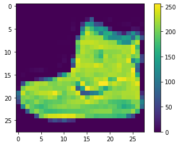
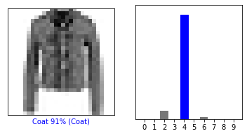
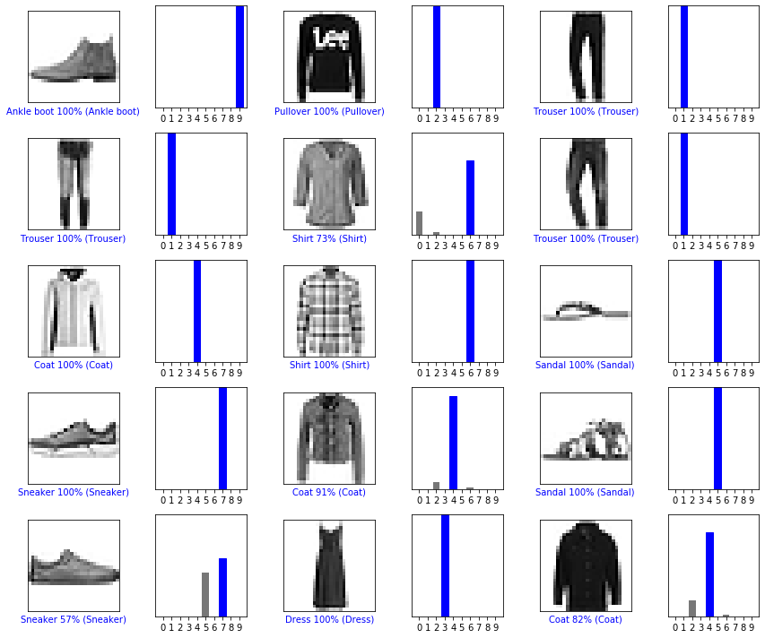
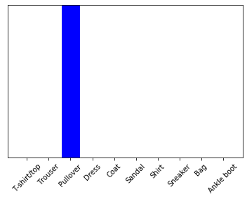

---
authors:
- admin
categories: []
date: "2020-02-05T00:00:00Z"
draft: false
featured: false
image:
  caption: ""
  focal_point: ""
lastMod: "2020-04-05T00:00:00Z"
projects: []
subtitle: Image classification with Keras
summary: Image classification with Keras
tags: []
title: Image classification with Keras
---


This guides trains a neural network model to classify images of clothing, like sneakers and shirts.


```python
# Tensorflow and tf.keras
import tensorflow as tf
from tensorflow import keras

# Helper libraries
import numpy as np
import matplotlib.pyplot as plt

print(tf.__version__)
```


    ---------------------------------------------------------------------------

    ImportError                               Traceback (most recent call last)

    ~\Anaconda3\lib\site-packages\tensorflow\python\pywrap_tensorflow.py in <module>
         57 
    ---> 58   from tensorflow.python.pywrap_tensorflow_internal import *
         59 
    

    ~\Anaconda3\lib\site-packages\tensorflow\python\pywrap_tensorflow_internal.py in <module>
         27             return _mod
    ---> 28     _pywrap_tensorflow_internal = swig_import_helper()
         29     del swig_import_helper
    

    ~\Anaconda3\lib\site-packages\tensorflow\python\pywrap_tensorflow_internal.py in swig_import_helper()
         23             try:
    ---> 24                 _mod = imp.load_module('_pywrap_tensorflow_internal', fp, pathname, description)
         25             finally:
    

    ~\Anaconda3\lib\imp.py in load_module(name, file, filename, details)
        241         else:
    --> 242             return load_dynamic(name, filename, file)
        243     elif type_ == PKG_DIRECTORY:
    

    ~\Anaconda3\lib\imp.py in load_dynamic(name, path, file)
        341             name=name, loader=loader, origin=path)
    --> 342         return _load(spec)
        343 
    

    ImportError: DLL load failed: Le module spécifié est introuvable.

    
    During handling of the above exception, another exception occurred:
    

    ImportError                               Traceback (most recent call last)

    <ipython-input-1-5ea659dcf2be> in <module>
          1 # Tensorflow and tf.keras
    ----> 2 import tensorflow as tf
          3 from tensorflow import keras
          4 
          5 # Helper libraries
    

    ~\Anaconda3\lib\site-packages\tensorflow\__init__.py in <module>
         39 import sys as _sys
         40 
    ---> 41 from tensorflow.python.tools import module_util as _module_util
         42 from tensorflow.python.util.lazy_loader import LazyLoader as _LazyLoader
         43 
    

    ~\Anaconda3\lib\site-packages\tensorflow\python\__init__.py in <module>
         48 import numpy as np
         49 
    ---> 50 from tensorflow.python import pywrap_tensorflow
         51 
         52 # Protocol buffers
    

    ~\Anaconda3\lib\site-packages\tensorflow\python\pywrap_tensorflow.py in <module>
         67 for some common reasons and solutions.  Include the entire stack trace
         68 above this error message when asking for help.""" % traceback.format_exc()
    ---> 69   raise ImportError(msg)
         70 
         71 # pylint: enable=wildcard-import,g-import-not-at-top,unused-import,line-too-long
    

    ImportError: Traceback (most recent call last):
      File "C:\Users\saif\Anaconda3\lib\site-packages\tensorflow\python\pywrap_tensorflow.py", line 58, in <module>
        from tensorflow.python.pywrap_tensorflow_internal import *
      File "C:\Users\saif\Anaconda3\lib\site-packages\tensorflow\python\pywrap_tensorflow_internal.py", line 28, in <module>
        _pywrap_tensorflow_internal = swig_import_helper()
      File "C:\Users\saif\Anaconda3\lib\site-packages\tensorflow\python\pywrap_tensorflow_internal.py", line 24, in swig_import_helper
        _mod = imp.load_module('_pywrap_tensorflow_internal', fp, pathname, description)
      File "C:\Users\saif\Anaconda3\lib\imp.py", line 242, in load_module
        return load_dynamic(name, filename, file)
      File "C:\Users\saif\Anaconda3\lib\imp.py", line 342, in load_dynamic
        return _load(spec)
    ImportError: DLL load failed: Le module spécifié est introuvable.
    
    
    Failed to load the native TensorFlow runtime.
    
    See https://www.tensorflow.org/install/errors
    
    for some common reasons and solutions.  Include the entire stack trace
    above this error message when asking for help.


### Import the Fashion MNIST dataset

This guide uses the Fashion MNIST dataset which contains 70,000 grayscale images in 10 categories. The images show individual articles of cloting at low resolution (28 by 28 pixels).
Here 60,0000 images are used to train the network and 10,000 images to evaluate how accurately the network learned to classify images.


```python
fashion_mnist = keras.datasets.fashion_mnist
(train_images, train_labels), (test_images, test_labels) = fashion_mnist.load_data()
```

    Downloading data from https://storage.googleapis.com/tensorflow/tf-keras-datasets/train-labels-idx1-ubyte.gz
    32768/29515 [=================================] - 0s 0us/step
    Downloading data from https://storage.googleapis.com/tensorflow/tf-keras-datasets/train-images-idx3-ubyte.gz
    26427392/26421880 [==============================] - 1s 0us/step
    Downloading data from https://storage.googleapis.com/tensorflow/tf-keras-datasets/t10k-labels-idx1-ubyte.gz
    8192/5148 [===============================================] - 0s 0us/step
    Downloading data from https://storage.googleapis.com/tensorflow/tf-keras-datasets/t10k-images-idx3-ubyte.gz
    4423680/4422102 [==============================] - 0s 0us/step
    

Loading the dataset returns four NumPy arrays:

* The `train_images` and `train_labels` arrays are the _training_ set
* The model is tested against the test _set_, the `test_images` and `test_labels` arrays

The images are 28*28 NumPy arrays, with pixel values ranging from 0 to 255. The labels are an array of integers, ranging from 0 to 0. These correspond to the class of clothing the image represents

|Label|Class|
|------|-----|
| 0 | T-shirt/top |
| 1 | Trouser |
| 2 | Pullover |
| 3 | Dress |
| 4 | Coat |
| 5 | Sandal |
| 6 | Shirt |
| 7 | Sneaker |
| 8 | Bag |
| 9 | Ankle boot|

Each image is mapped to a single label. Since the class names are not included with the dataset, store them here to use later when plotting the images:


```python
class_names = ['T-shirt/top', 'Trouser', 'Pullover', 'Dress', 'Coat',
               'Sandal', 'Shirt', 'Sneaker', 'Bag', 'Ankle boot']
```

# Explore the data

The following shows there are 60,000 images in the training set, with each image represented as 28 x 28 pixels


```python
train_images.shape
```


    (60000, 28, 28)


Likewise, there are 60,000 labels in the training set:


```python
len(train_labels)
```


    60000


Each label is an integer between 0 and 9:


```python
train_labels
```


    array([9, 0, 0, ..., 3, 0, 5], dtype=uint8)


There are 10,000 images in the test set. Again, each image is represented as 28 x 28 pixels:


```python
test_images.shape
```


    (10000, 28, 28)


And the test set contains 10,000 images labels:


```python
len(test_labels)
```


    10000


# Preprocess the data

The data must be preprocessed before training the network. If you inspect the first image in the training set, you will see that the pixel values fall in the range of 0 to 255:


```python
plt.figure()
plt.imshow(train_images[0])
plt.colorbar()
plt.grid(False)
plt.show()
```





Scale these values to a range of 0 to 1 before feeding them to the neural network model. To do so, divide the values by 255. It's important that the training set and the testing set be preprocessed in the same way:


```python
train_images = train_images / 255.0
test_images = test_images / 255.0
```

To verify that the data is in the correct format and that you're ready to build and train the network, let's display the first 25 images from the training set and display the class name below each image


```python
plt.figure(figsize=(10,10))
for i in range(25):
    plt.subplot(5,5,i+1)
    plt.xticks([])
    plt.yticks([])
    plt.grid(False)
    plt.imshow(train_images[i], cmap=plt.cm.binary)
    plt.xlabel(class_names[train_labels[i]])
plt.show()
```


# Build the model
Building the neural network requires configuring the layers of the model, then compiling the model
## Set up the layers
The basic building block of a neural network is the layer. Layers extract representations from the data fed into them.
Most of deep learning consists of chaining together simple layers. Most layers, such as `tf.keras.layers.Dense`, have parameters that are learned during training.


```python
model = keras.Sequential([
    keras.layers.Flatten(input_shape=(28,28)),
    keras.layers.Dense(128, activation='relu'),
    keras.layers.Dense(10)
])
```

The first layer in this network, `tf.keras.layers.Flatten`, transforms the format of the images from a two dimensional array (of 28 by 28 pixels) to a one-dimensional array (of 28 * 28 = 784 pixels). Think of this layer as unstacking rows of pixels in the image and lining them up. This layer has no parameters to learn, it only reformats the data.
After the pixels are flattened, the network consists of a sequence of two `tf.keras.layers.Dense` layers. These are densely connected, or fully connected, neural layers. The first `Dense` layer has 128 nodes (or neurones). The second (and last) layer returns a logits array with legth of 10. Each node contains a score that indicates the current image belongs to one of the 10 classes.

## Complie the model
Before the model is ready for training, it needs a few more settings. These are added during the model's compile step:
* __Loss function__: This measures how accurate the model is during the training. You want to minimize this function to "steer" the model in the right direction
* __Optimize__: This is ho the model is updated based on the data it sees and its loss function
* __Metrics__: Used to monitor the training and testing steps. The following example uses _accuracy_, the fraction of the images  that are correctly classified.


```python
model.compile(optimizer='adam',
             loss=tf.keras.losses.SparseCategoricalCrossentropy(from_logits=True),
             metrics=['accuracy'])
```

## Train the model
Training the neural network model requires the following steps:
1. Feed the training data to the model. In this example, the training data is in the `train_images` and `train_labels` arrays
2. The model learns to associate images and labels
3. You ask the model to make predictions about a tes set (in this example, the `test_images` array)
4. Verify that predictions match the labels from the `test_labels` array

### Feed the mdel
To start training, call the `model.fit` method


```python
model.fit(train_images, train_labels, epochs=10)
```

    Train on 60000 samples
    Epoch 1/10
    60000/60000 [==============================] - 3s 56us/sample - loss: 0.4985 - accuracy: 0.8241
    Epoch 2/10
    60000/60000 [==============================] - 3s 51us/sample - loss: 0.3762 - accuracy: 0.8648
    Epoch 3/10
    60000/60000 [==============================] - 3s 54us/sample - loss: 0.3355 - accuracy: 0.8773
    Epoch 4/10
    60000/60000 [==============================] - 3s 52us/sample - loss: 0.3149 - accuracy: 0.8838
    Epoch 5/10
    60000/60000 [==============================] - 3s 50us/sample - loss: 0.2966 - accuracy: 0.8911
    Epoch 6/10
    60000/60000 [==============================] - 3s 53us/sample - loss: 0.2794 - accuracy: 0.8969
    Epoch 7/10
    60000/60000 [==============================] - 3s 51us/sample - loss: 0.2683 - accuracy: 0.9006
    Epoch 8/10
    60000/60000 [==============================] - 3s 52us/sample - loss: 0.2571 - accuracy: 0.9032
    Epoch 9/10
    60000/60000 [==============================] - 3s 53us/sample - loss: 0.2479 - accuracy: 0.9079
    Epoch 10/10
    60000/60000 [==============================] - 3s 50us/sample - loss: 0.2370 - accuracy: 0.9119
    


    <tensorflow.python.keras.callbacks.History at 0x22bf3aaa248>


As the model trains, the loss and accuracy metrics are displayed. This model reaches an accuracy of about 0.91 ont the training data

### Evaluate accuracy
Next, compare how the model performs on the test dataset:


```python
test_loss, test_acc = model.evaluate(test_images, test_labels, verbose = 2)
```

    10000/10000 - 0s - loss: 0.3402 - accuracy: 0.8807
    

It turns out that the accuracy on the test dataset is a little less than the accuracy on the training dataset. This gap between training accuracy and test accuracy represents overfitting. Overfitting happens when a machine learning model performs worse on new, previously unseen inputs that it does on the training data. An overfitted model "memorizes" the noise and details in the training dataset to a point where it negatively impacts the performance of the model on the new data.

### Make preditions
Once the model is trained, we can use it to make predictions about some images. We attach a sotmax layer to convert the logits to probabilities, whch are easier to interpret.


```python
probability_model = tf.keras.Sequential([model,
                                        tf.keras.layers.Softmax()])
```


```python
predictions = probability_model.predict(test_images)
```

Here, the model has predicted the label for each image in the testing set. Let's take a look at the first prediction:


```python
predictions[0]
```


    array([4.7376286e-10, 4.1785884e-11, 1.0244653e-09, 4.7934031e-13,
           7.8960101e-09, 4.1338499e-04, 4.5091014e-07, 2.3938799e-03,
           1.2441374e-08, 9.9719232e-01], dtype=float32)


A prediction is an array of 10 numbers. They represent the model's confidence that the image corresponds to each of the 10 different classes pf clothing. We can identify which labe has the highest confidence value:


```python
np.argmax(predictions[0])
```


    9


So, the model is most confident that this image correspond to the class 9. In order to verify the the prediction, we can examine the real label in the test data set


```python
test_labels[0]
```


    9


Now, we can verify the different class prediction by plotting the articles with the predicted probabilities for corresponding to the differents classes


```python
def plot_image(i, predictions_array, true_label, img):
    predictions_array, true_label, img = predictions_array, true_label[i], img[i]
    plt.grid(False)
    plt.xticks([])
    plt.yticks([])
    
    plt.imshow(img, cmap = plt.cm.binary)
    
    predicted_label = np.argmax(predictions_array)
    if predicted_label == true_label:
        color = 'blue'
    else:
        color = 'red'
        
    plt.xlabel("{} {:2.0f}% ({})".format(class_names[predicted_label],
                                100*np.max(predictions_array),
                                class_names[true_label]),
                                color=color)
    
def plot_value_array(i, predictions_array, true_label):
    predictions_array, true_label = predictions_array, true_label[i]
    plt.grid(False)
    plt.xticks(range(10))
    plt.yticks([])
    thisplot = plt.bar(range(10), predictions_array, color="#777777")
    plt.ylim([0,1])
    predicted_label = np.argmax(predictions_array)
    
    thisplot[predicted_label].set_color('red')
    thisplot[true_label].set_color('blue')
     
```

### Verify predictions
We can use the trained model to make predictions about some images.
Let's plot some images predictions and prediction array. Correct prediction laels are blue and incorrect prediction labels are red. The number gives the percentage of the predicted label.


```python
i = 10
plt.figure(figsize=(6,3))
plt.subplot(1,2,1)
plot_image(i, predictions[i], test_labels, test_images)
plt.subplot(1,2,2)
plot_value_array(i, predictions[i], test_labels)
plt.show
```


    <function matplotlib.pyplot.show(*args, **kw)>





Let's plot several images with their predictions. We notice that the model can be wrong even when very confident


```python
# Plot the first X test images, their predicted labels, and the true labels.
# Color correct predictions in blue and incorrect predictions in red.
num_rows = 5
num_cols = 3
num_images = num_rows*num_cols
plt.figure(figsize=(2*2*num_cols, 2*num_rows))
for i in range(num_images):
  plt.subplot(num_rows, 2*num_cols, 2*i+1)
  plot_image(i, predictions[i], test_labels, test_images)
  plt.subplot(num_rows, 2*num_cols, 2*i+2)
  plot_value_array(i, predictions[i], test_labels)
plt.tight_layout()
plt.show()
```





## Use the trained model
Finally, we can use the trained model to make a prediction about a single image


```python
# Take an image from the test dataset
img = test_images[1]
```

tf.keras models are optimized to make predictions on a batch, or collection, of examples at once. Accordingly, even though you are using a single image you need to add it to a list


```python
# Add the image to a batch where it is the only member
img = (np.expand_dims(img,0))
print(img.shape)
```

    (1, 28, 28)
    

Now predict the correct label for this image


```python
predictions_single = probability_model.predict(img)
print(predictions_single)
```

    [[8.9977939e-06 5.5037474e-13 9.9878293e-01 2.8940199e-14 9.9826534e-04
      2.8661677e-11 2.0977325e-04 4.3083792e-17 1.6156602e-10 1.0528947e-15]]
    


```python
plot_value_array(1, predictions_single[0], test_labels)
_ = plt.xticks(range(10), class_names, rotation=45)
```





`keras.Model.predict` returns a list of lists - one list for each image in the batch of data. Grab the predictions for our (only) image in the batch


```python
np.argmax(predictions_single[0])
```


    2


```python

```
